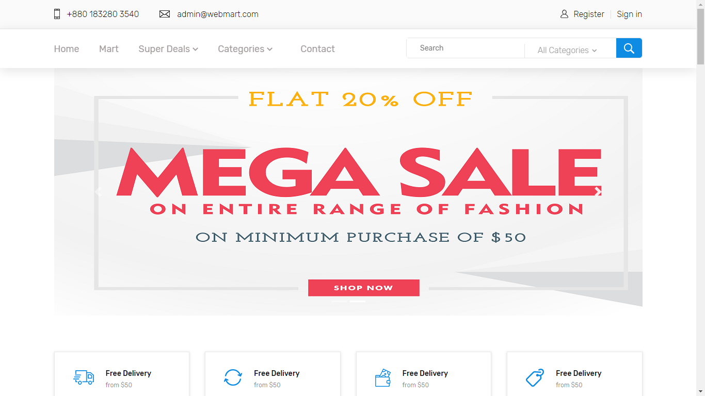
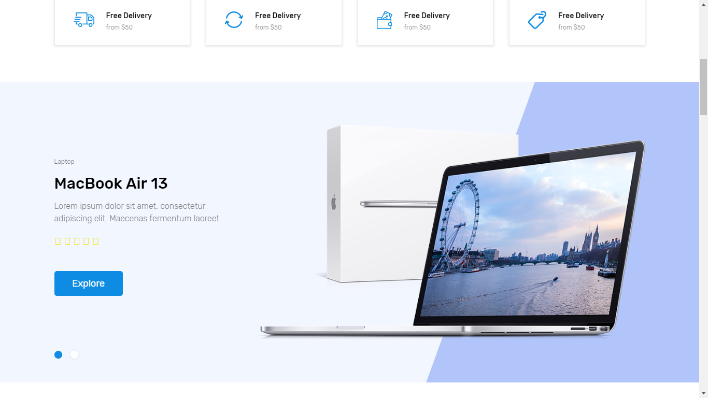
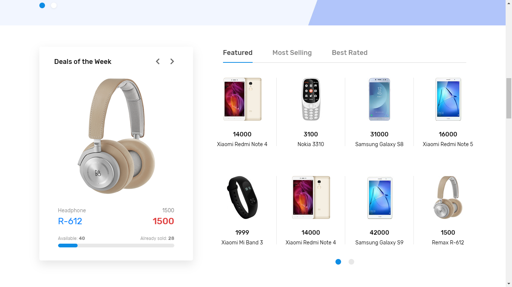
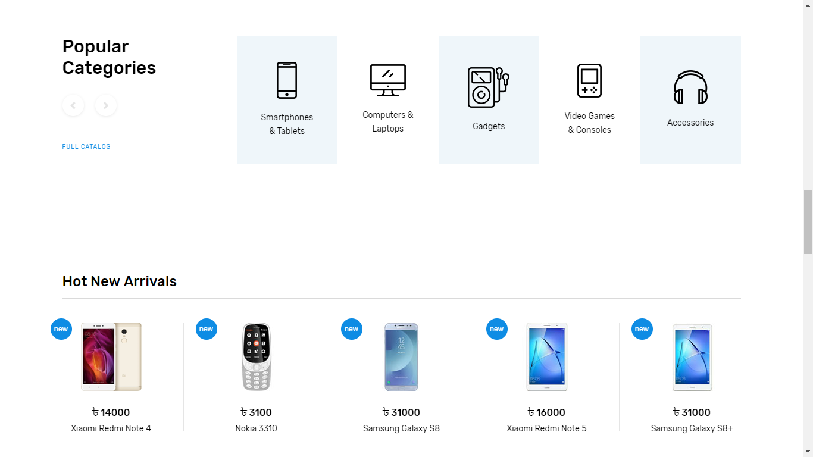
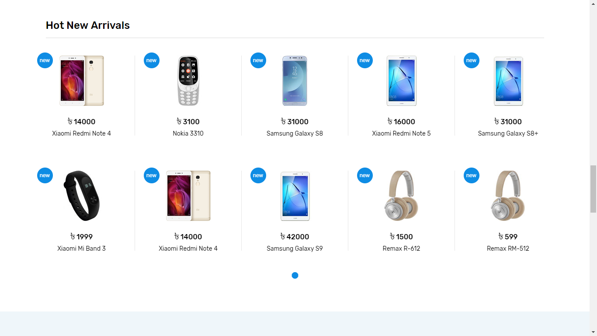
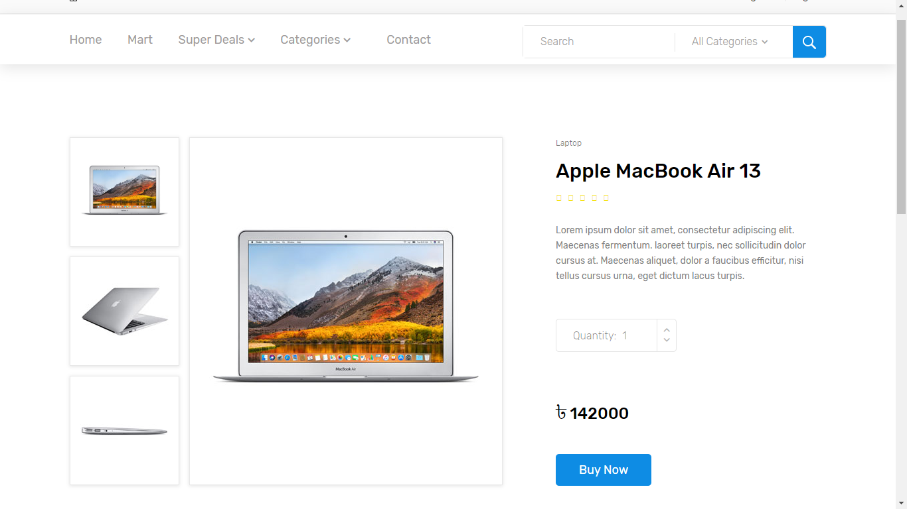
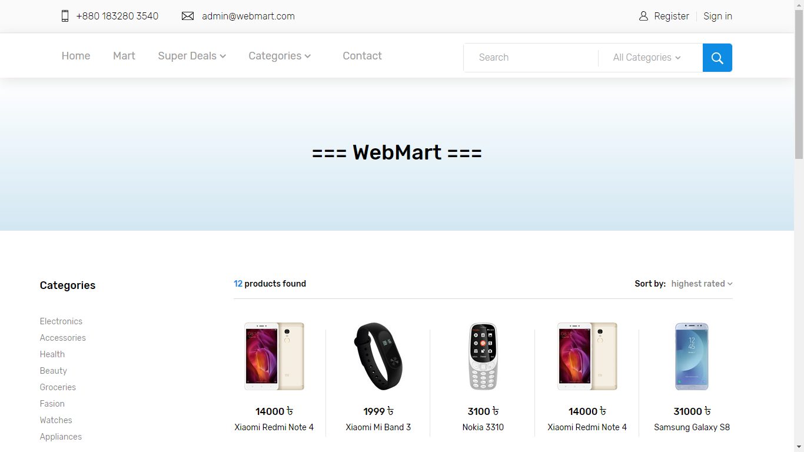
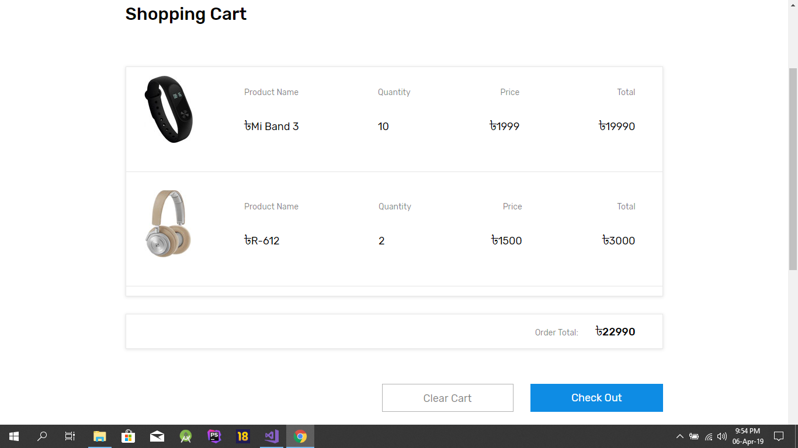

# WebMart -- Online Gadget Shop

## The website is developed using ASP.NET MVC-5

### Some sample snapshot of the website is shown below

<table>
  <tr>
    <td>
      
    </td>
    <td>
      
    </td>
  </tr>  
  
  <tr>
    <td>
      
    </td>
    <td>
      
    </td>
  </tr>  
  <tr>
    <td>
      
    </td>
    <td>
      
    </td>
  </tr>  
  <tr>
    <td>
      
    </td>
    <td>
      
    </td>
  </tr>

</table>
